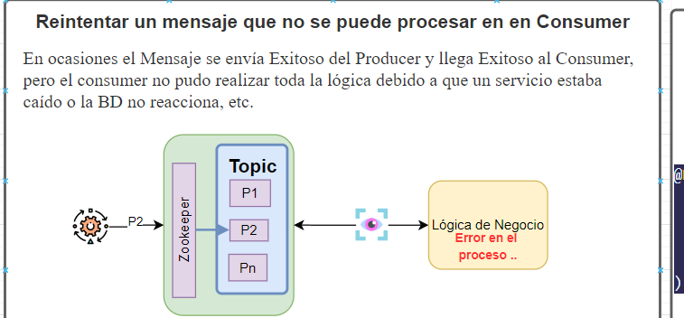
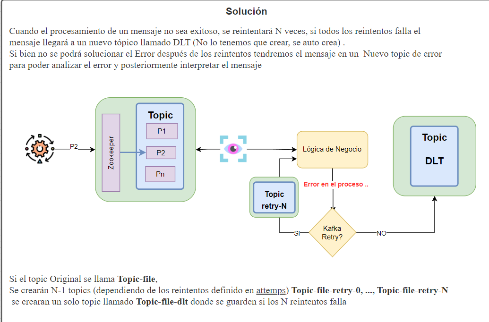
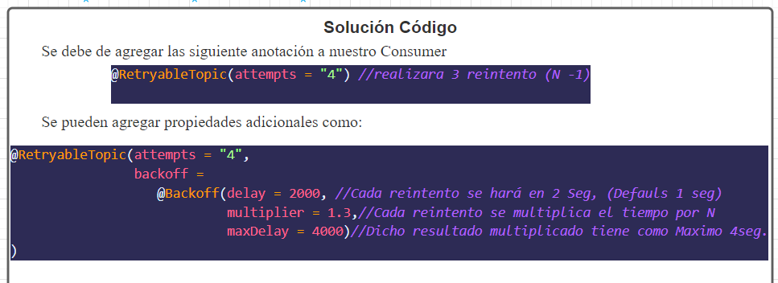

# kafka-Consumer-Retry




### En este proyecto se encunetra un Producter y consumer que cuenta los Reintentos
No es necesario crear los topic debedo a que se genera automaticamenta <br>
Pero si es neceario tener un Kafka y zookerper levantado/ejecutando <br>
Para Mandar los mensajes se invoca el siguiente EndPoint <br>
```
Method: Post
URL:localhost:9191/producer-app/publishNew
Body:
{
    "id": 1,
    "firstName": "",
    "lastName": "",
    "email": "",
    "gender": "",
    "ipAddress": ""
}
```
El cuerpo del mensaje no importa por que no se lee, el endpont lee/envia los datos del archivo user.csv del Resouces <br>
Dichos datos del archivo tiene unas IP´s de las cuales las Ip´s <br>
``32.241.244.236", "15.55.49.164", "81.1.95.253", "126.130.43.183"``
simularan que cayeron en error